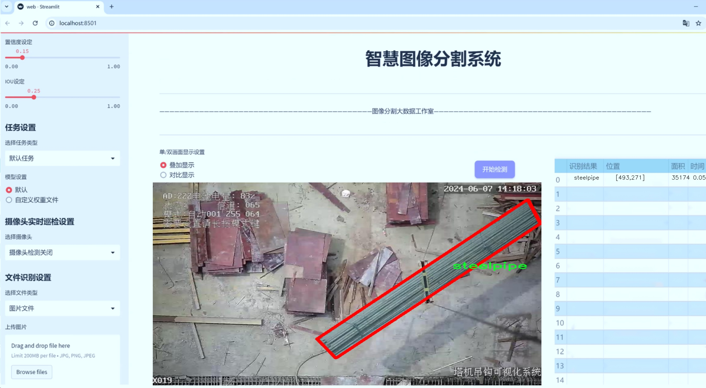
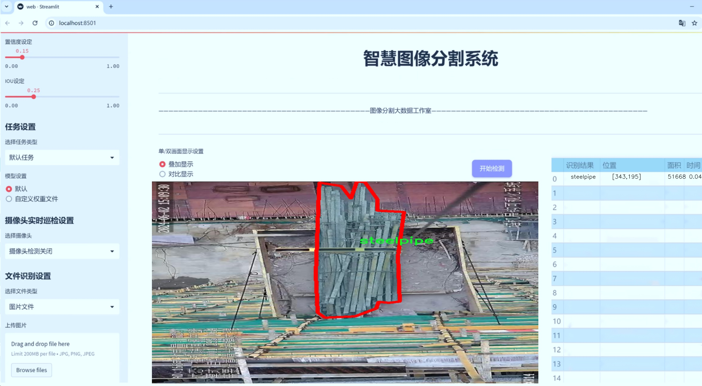
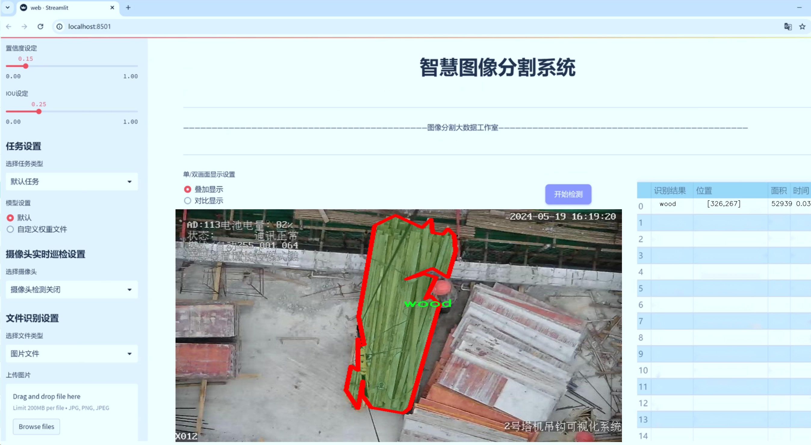
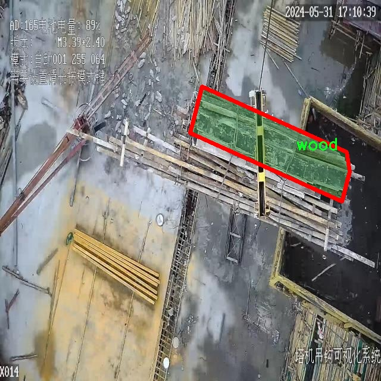
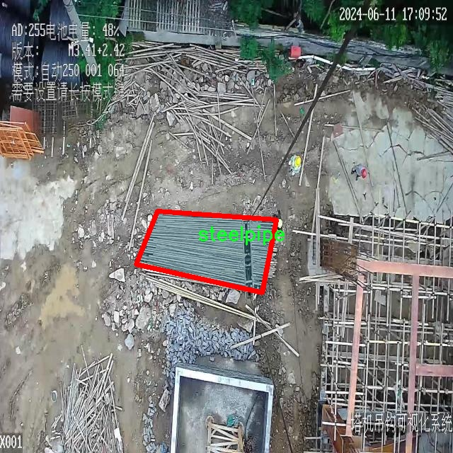
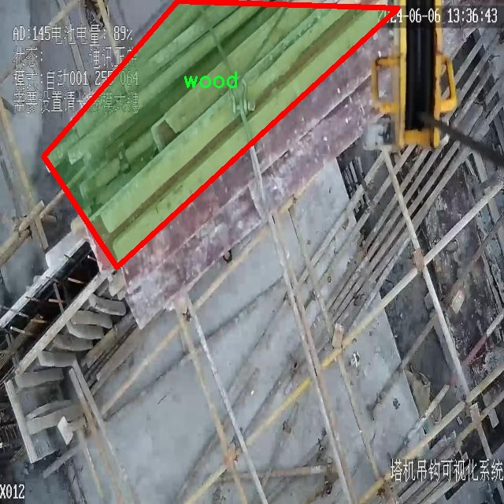
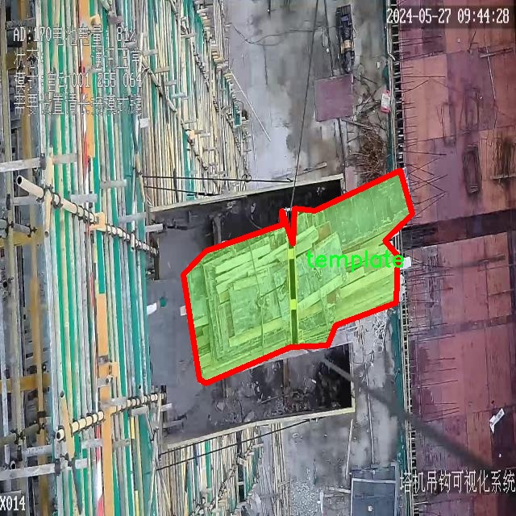

# 建筑材料分割系统： yolov8-seg-goldyolo

### 1.研究背景与意义

[参考博客](https://gitee.com/YOLOv8_YOLOv11_Segmentation_Studio/projects)

[博客来源](https://kdocs.cn/l/cszuIiCKVNis)

研究背景与意义

随着建筑行业的快速发展，建筑材料的管理与利用变得愈发重要。建筑材料的种类繁多，如何高效、准确地识别和分割这些材料，成为了建筑信息化管理的一个关键问题。传统的建筑材料识别方法往往依赖于人工检测，效率低下且容易受到人为因素的影响，难以满足现代建筑工程对精确度和效率的高要求。因此，基于计算机视觉和深度学习的自动化识别与分割技术应运而生，成为解决这一问题的有效手段。

YOLO（You Only Look Once）系列模型因其高效的实时目标检测能力而广泛应用于各类视觉任务中。特别是YOLOv8作为该系列的最新版本，凭借其在速度和精度上的显著提升，成为了建筑材料分割领域的研究热点。然而，尽管YOLOv8在目标检测方面表现优异，但在建筑材料的实例分割任务中，仍然面临着一些挑战，如复杂背景下的材料识别、不同材料之间的相似性以及材料在图像中的遮挡等问题。因此，改进YOLOv8以增强其在建筑材料分割中的表现，具有重要的研究意义。

本研究基于mes621数据集，包含3400张图像和4类建筑材料（钢筋、钢管、模板和木材），为建筑材料的实例分割提供了丰富的样本。这一数据集的多样性和复杂性，使得研究者能够在真实场景中验证改进模型的有效性。通过对该数据集的深入分析，可以发现不同材料在图像中的特征差异，以及它们在实际应用中的重要性。例如，钢筋和钢管在建筑结构中扮演着重要的支撑角色，而模板和木材则在施工过程中具有不可或缺的作用。因此，准确分割和识别这些材料，不仅能够提高建筑施工的效率，还能为后续的材料管理和资源优化提供数据支持。

在技术层面，本研究将针对YOLOv8的网络结构进行改进，结合最新的深度学习技术，如注意力机制和特征金字塔网络，提升模型对建筑材料的分割精度。同时，采用数据增强和迁移学习等策略，进一步提升模型在小样本情况下的表现。这些技术的应用，不仅能够提高模型的鲁棒性，还能有效降低训练时间，满足实际应用中的实时性需求。

综上所述，基于改进YOLOv8的建筑材料分割系统的研究，不仅能够推动建筑行业的智能化进程，还能为相关领域的研究提供新的思路和方法。通过提高建筑材料的识别与分割精度，能够为建筑施工的安全性、经济性和可持续性提供有力保障，具有重要的理论价值和实际应用意义。

### 2.图片演示







注意：本项目提供完整的训练源码数据集和训练教程,由于此博客编辑较早,暂不提供权重文件（best.pt）,需要按照6.训练教程进行训练后实现上图效果。

### 3.视频演示

[3.1 视频演示](https://www.bilibili.com/video/BV1WCzzYsEkL/)

### 4.数据集信息

##### 4.1 数据集类别数＆类别名

nc: 4
names: ['rebar', 'steelpipe', 'template', 'wood']


##### 4.2 数据集信息简介

数据集信息展示

在构建高效的建筑材料分割系统时，数据集的选择与构建至关重要。本研究所采用的数据集名为“mes621”，该数据集专门为改进YOLOv8-seg模型在建筑材料分割任务中的表现而设计。mes621数据集包含四个主要类别，分别是“rebar”（钢筋）、“steelpipe”（钢管）、“template”（模板）和“wood”（木材）。这些类别的选择反映了建筑行业中常见的材料类型，为模型的训练提供了丰富的样本。

mes621数据集的构建过程考虑了建筑材料的多样性和复杂性。每个类别的样本均经过精心挑选，以确保数据的代表性和多样性。钢筋作为建筑结构中不可或缺的组成部分，其形状、尺寸和排列方式各异，因此在数据集中包含了不同类型和规格的钢筋图像。钢管同样是建筑工程中常用的材料，其直径、长度和表面处理方式的差异也被充分考虑，确保模型能够学习到不同钢管的特征。

模板作为建筑施工中的重要工具，其形状和用途多样，因此在mes621数据集中，模板的样本覆盖了多种类型，包括木制模板和金属模板等。这种多样性使得模型在实际应用中能够更好地适应不同的施工场景。最后，木材作为建筑材料中最常见的一种，其种类繁多，从原木到加工后的成品，mes621数据集也涵盖了多种木材的图像，以帮助模型识别和分割不同类型的木材。

在数据集的标注过程中，采用了精确的分割标注技术，以确保每个类别的边界清晰可辨。这种高质量的标注不仅提高了模型的训练效果，也为后续的评估和测试提供了可靠的基础。通过对mes621数据集的深入分析，我们可以发现，数据集中样本的多样性和标注的准确性是提升YOLOv8-seg模型性能的关键因素。

为了确保模型的泛化能力，mes621数据集还进行了数据增强处理，包括旋转、缩放、翻转等多种变换。这些增强技术的应用，使得模型在面对不同场景和条件下的建筑材料时，能够保持较高的识别精度。此外，数据集的规模和样本数量也经过精心设计，以满足深度学习模型对大规模数据的需求，从而有效避免过拟合现象的发生。

总之，mes621数据集的构建不仅考虑了建筑材料的多样性和复杂性，还注重了数据标注的准确性和数据增强的有效性。这些因素共同为改进YOLOv8-seg模型在建筑材料分割任务中的应用奠定了坚实的基础。通过对mes621数据集的深入研究与应用，我们期待能够在建筑材料分割领域取得更为显著的进展，推动相关技术的发展与应用。










### 5.项目依赖环境部署教程（零基础手把手教学）

[5.1 环境部署教程链接（零基础手把手教学）](https://www.bilibili.com/video/BV1jG4Ve4E9t/?vd_source=bc9aec86d164b67a7004b996143742dc)


[5.2 安装Python虚拟环境创建和依赖库安装视频教程链接（零基础手把手教学）](https://www.bilibili.com/video/BV1nA4VeYEze/?vd_source=bc9aec86d164b67a7004b996143742dc)

### 6.手把手YOLOV8-seg训练视频教程（零基础手把手教学）

[6.1 手把手YOLOV8-seg训练视频教程（零基础小白有手就能学会）](https://www.bilibili.com/video/BV1cA4VeYETe/?vd_source=bc9aec86d164b67a7004b996143742dc)


按照上面的训练视频教程链接加载项目提供的数据集，运行train.py即可开始训练



     Epoch   gpu_mem       box       obj       cls    labels  img_size
     1/200     0G   0.01576   0.01955  0.007536        22      1280: 100%|██████████| 849/849 [14:42<00:00,  1.04s/it]
               Class     Images     Labels          P          R     mAP@.5 mAP@.5:.95: 100%|██████████| 213/213 [01:14<00:00,  2.87it/s]
                 all       3395      17314      0.994      0.957      0.0957      0.0843

     Epoch   gpu_mem       box       obj       cls    labels  img_size
     2/200     0G   0.01578   0.01923  0.007006        22      1280: 100%|██████████| 849/849 [14:44<00:00,  1.04s/it]
               Class     Images     Labels          P          R     mAP@.5 mAP@.5:.95: 100%|██████████| 213/213 [01:12<00:00,  2.95it/s]
                 all       3395      17314      0.996      0.956      0.0957      0.0845

     Epoch   gpu_mem       box       obj       cls    labels  img_size
     3/200     0G   0.01561    0.0191  0.006895        27      1280: 100%|██████████| 849/849 [10:56<00:00,  1.29it/s]
               Class     Images     Labels          P          R     mAP@.5 mAP@.5:.95: 100%|███████   | 187/213 [00:52<00:00,  4.04it/s]
                 all       3395      17314      0.996      0.957      0.0957      0.0845


### 7.50+种全套YOLOV8-seg创新点加载调参实验视频教程（一键加载写好的改进模型的配置文件）

[7.1 50+种全套YOLOV8-seg创新点加载调参实验视频教程（一键加载写好的改进模型的配置文件）](https://www.bilibili.com/video/BV1Hw4VePEXv/?vd_source=bc9aec86d164b67a7004b996143742dc)

### YOLOV8-seg算法简介

原始YOLOv8-seg算法原理

YOLOv8-seg算法是YOLO系列的最新进展，专注于目标检测与实例分割任务的结合，标志着计算机视觉领域的又一次重要突破。作为一种一阶段目标检测算法，YOLOv8-seg不仅继承了YOLO系列的高效性和实时性，还在模型结构和功能上进行了多项创新，使其在精度和速度上均优于前代模型。

YOLOv8-seg的核心理念在于将目标检测与分割任务统一到一个框架中进行处理。这一策略的实施，首先得益于YOLOv8的网络结构设计。YOLOv8的网络由主干网络（backbone）、特征增强网络（neck）和检测头（head）三部分组成，主干网络采用了CSP（Cross Stage Partial）网络结构，旨在通过有效的特征提取提升模型的表现。特征增强网络则引入了PAN-FPN（Path Aggregation Network - Feature Pyramid Network）的思想，旨在更好地融合多尺度特征，以便在处理不同大小的目标时保持高效性和准确性。

在检测头部分，YOLOv8-seg采用了解耦头的设计，这一创新显著提高了模型在复杂场景下的表现。传统的目标检测模型通常将分类和回归任务耦合在一起，这可能导致在某些情况下分类精度下降或定位不准确。而YOLOv8-seg通过将这两个任务分开处理，使得每个任务都能更加专注于自身的目标，从而提升了整体的检测性能。此外，YOLOv8-seg采用了Anchor-free的目标检测方法，这一方法通过直接回归目标的位置和大小，避免了传统方法中锚框选择和调整的繁琐过程。这种创新使得模型在处理不同形状和尺度的目标时更加灵活，能够快速聚焦于目标的实际边界框区域。

在YOLOv8-seg的实现过程中，模型的轻量化设计也是其一大亮点。相较于之前的YOLO系列，YOLOv8-seg在模型权重文件的大小上进行了优化，使其能够在各种嵌入式设备上高效运行。这一特性使得YOLOv8-seg在实时检测的应用场景中表现尤为出色，无论是在移动设备还是边缘计算设备上，都能保持较高的检测精度和速度。

此外，YOLOv8-seg在损失函数的设计上也进行了创新，采用了BCELoss作为分类损失，DFLLoss和CIoULoss作为回归损失。这种损失函数的组合能够更好地平衡分类和回归任务之间的关系，进一步提升模型的训练效果和检测精度。

YOLOv8-seg的训练过程也充分考虑了数据增强策略的有效性。通过动态Task-Aligned Assigner样本分配策略和在训练的最后10个epoch中关闭马赛克增强，YOLOv8-seg能够更好地适应不同的训练数据，提高模型的泛化能力。这些设计的结合，使得YOLOv8-seg在处理复杂场景和多样化目标时，展现出强大的适应性和鲁棒性。

总的来说，YOLOv8-seg算法的原理在于通过创新的网络结构设计、解耦的任务处理方式、Anchor-free的检测方法以及优化的损失函数和数据增强策略，将目标检测与实例分割有效结合，形成了一个高效、精确且灵活的计算机视觉解决方案。随着YOLOv8-seg的不断发展和应用，其在智能监控、自动驾驶、机器人视觉等领域的潜力将进一步得到挖掘，推动计算机视觉技术的进步与普及。


### 9.系统功能展示（检测对象为举例，实际内容以本项目数据集为准）

图9.1.系统支持检测结果表格显示

  图9.2.系统支持置信度和IOU阈值手动调节

  图9.3.系统支持自定义加载权重文件best.pt(需要你通过步骤5中训练获得)

  图9.4.系统支持摄像头实时识别

  图9.5.系统支持图片识别

  图9.6.系统支持视频识别

  图9.7.系统支持识别结果文件自动保存

  图9.8.系统支持Excel导出检测结果数据


### 10.50+种全套YOLOV8-seg创新点原理讲解（非科班也可以轻松写刊发刊，V11版本正在科研待更新）

#### 10.1 由于篇幅限制，每个创新点的具体原理讲解就不一一展开，具体见下列网址中的创新点对应子项目的技术原理博客网址【Blog】：


[10.1 50+种全套YOLOV8-seg创新点原理讲解链接](https://gitee.com/qunmasj/good)

#### 10.2 部分改进模块原理讲解(完整的改进原理见上图和技术博客链接)【如果此小节的图加载失败可以通过CSDN或者Github搜索该博客的标题访问原始博客，原始博客图片显示正常】

### YOLOv8模型
YOLOv8模型由Ultralytics团队在YOLOv5模型的基础上，吸收了近两年半来经过实际验证的各种改进，于2023年1月提出。与之前的一些YOLO 系列模型想类似，YOLOv8模型也有多种尺寸，下面以YOLOv8n为例，分析 YOLOv8模型的结构和改进点。YOLOv8模型网络结构如
输入图片的部分，由于发现Mosaic数据增强尽管这有助于提升模型的鲁棒性和泛化性，但是，在一定程度上，也会破坏数据的真实分布，使得模型学习到一些不好的信息。所以YOLOv8模型在训练中的最后10个epoch 停止使用Mosaic数据增强。


在网络结构上，首先主干网络的改变不大，主要是将C3模块替换为了C2f模块，该模块的结构在上图中已示出。C2f模块在C3模块的思路基础上，引入了YOLOv7中 ELAN的思路，引入了更多的跳层连接，这有助于该模块获得更丰富的梯度流信息，而且模型的轻量化得到了保证。依然保留了SPPF，效果不变的同时减少了该模块的执行时间。
在颈部网络中，也是将所有的C3模块更改为C2f模块，同时删除了两处上采样之前的卷积连接层。
在头部网络中，采用了YOLOX中使用的解耦头的思路，两条并行的分支分别提取类别和位置特征。由于分类任务更注重于分析特征图中提取到的特征与已输入图片的部分，由于发现 Mosaic数据增强尽管这有助于提升模型的鲁棒性和泛化性，但是，在一定程度上，也会破坏数据的真实分布，使得模型学习到一些不好的信息。所以YOLOv8模型在训练中的最后10个epoch停止使用Mosaic数据增强。
在网络结构上，首先主干网络的改变不大，主要是将C3模块替换为了C2f模块，该模块的结构在上图中已示出。C2f模块在C3模块的思路基础上，引入了YOLOv7中ELAN的思路，引入了更多的跳层连接，这有助于该模块获得更丰富的梯度流信息，而且模型的轻量化得到了保证。依然保留了SPPF，效果不变的同时减少了该模块的执行时间。
在颈部网络中，也是将所有的C3模块更改为C2f模块，同时删除了两处上采样之前的卷积连接层。
在头部网络中，采用了YOLOX中使用的解耦头的思路，两条并行的分支分别提取类别和位置特征。由于分类任务更注重于分析特征图中提取到的特征与已有类别中的哪一种更为相似，而定位任务更关注边界框与真值框的位置关系，并据此对边界框的坐标进行调整。侧重点的不同使得在使用两个检测头时收敛的速度和预测的精度有所提高。而且使用了无锚框结构，直接预测目标的中心，并使用TAL (Task Alignment Learning，任务对齐学习）来区分正负样本，引入了分类分数和IOU的高次幂乘积作为衡量任务对齐程度的指标，认为同时拥有好的定位和分类评价的在分类和定位损失函数中也引入了这项指标。
在模型的检测结果上，YOLOv8模型也取得了较好的成果，图为官方在coCO数据集上 YOLOv8模型的模型尺寸大小和检测的mAP50-95对比图。mAP50-95指的是IOU的值从50%取到95%，步长为5%，然后算在这些IOU下的mAP的均值。图的 a）图展示了YOLOv8在同尺寸下模型中参数没有较大增加的前提下取得了比其他模型更好的精度，图2-17的b)图展示了YOLOv8比其他YOLO系列模型在同尺寸时，推理速度更快且精度没有太大下降。


### 视觉transformer(ViT)简介
视觉transformer(ViT)最近在各种计算机视觉任务中证明了巨大的成功，并受到了相当多的关注。与卷积神经网络(CNNs)相比，ViT具有更强的全局信息捕获能力和远程交互能力，表现出优于CNNs的准确性，特别是在扩大训练数据大小和模型大小时[An image is worth 16x16 words: Transformers for image recognition at scale,Coatnet]。

尽管ViT在低分辨率和高计算领域取得了巨大成功，但在高分辨率和低计算场景下，ViT仍不如cnn。例如，下图(左)比较了COCO数据集上当前基于cnn和基于vit的一级检测器。基于vit的检测器(160G mac)和基于cnn的检测器(6G mac)之间的效率差距超过一个数量级。这阻碍了在边缘设备的实时高分辨率视觉应用程序上部署ViT。


左图:现有的基于vit的一级检测器在实时目标检测方面仍然不如当前基于cnn的一级检测器，需要的计算量多出一个数量级。本文引入了第一个基于vit的实时对象检测器来弥补这一差距。在COCO上，efficientvit的AP比efficientdet高3.8，而mac较低。与YoloX相比，efficient ViT节省67.2%的计算成本，同时提供更高的AP。

中:随着输入分辨率的增加，计算成本呈二次增长，无法有效处理高分辨率的视觉应用。

右图:高分辨率对图像分割很重要。当输入分辨率从1024x2048降低到512x1024时，MobileNetV2的mIoU减少12% (8.5 mIoU)。在不提高分辨率的情况下，只提高模型尺寸是无法缩小性能差距的。

ViT的根本计算瓶颈是softmax注意模块，其计算成本随输入分辨率的增加呈二次增长。例如，如上图(中)所示，随着输入分辨率的增加，vit- small[Pytorch image models. https://github.com/rwightman/ pytorch-image-models]的计算成本迅速显著大于ResNet-152的计算成本。

解决这个问题的一个直接方法是降低输入分辨率。然而，高分辨率的视觉识别在许多现实世界的计算机视觉应用中是必不可少的，如自动驾驶，医疗图像处理等。当输入分辨率降低时，图像中的小物体和精细细节会消失，导致目标检测和语义分割性能显著下降。

上图(右)显示了在cityscape数据集上不同输入分辨率和宽度乘法器下MobileNetV2的性能。例如，将输入分辨率从1024x2048降低到512x1024会使cityscape的性能降低12% (8.5 mIoU)。即使是3.6倍高的mac，只放大模型尺寸而不增加分辨率也无法弥补这一性能损失。

除了降低分辨率外，另一种代表性的方法是限制softmax注意，方法是将其范围限制在固定大小的局部窗口内[Swin transformer,Swin transformer v2]或降低键/值张量的维数[Pyramid vision transformer,Segformer]。然而，它损害了ViT的非局部注意能力，降低了全局接受域(ViT最重要的优点)，使得ViT与大内核cnn的区别更小[A convnet for the 2020s,Scaling up your kernels to 31x31: Revisiting large kernel design in cnns,Lite pose: Efficient architecture design for 2d human pose estimation]。

本文介绍了一个有效的ViT体系结构，以解决这些挑战。发现没有必要坚持softmax注意力。本文建议用线性注意[Transformers are rnns: Fast autoregressive transformers with linear attention]代替softmax注意。

线性注意的关键好处是，它保持了完整的n 2 n^2n 2
 注意映射，就像softmax注意。同时，它利用矩阵乘法的联想特性，避免显式计算完整的注意映射，同时保持相同的功能。因此，它保持了softmax注意力的全局特征提取能力，且计算复杂度仅为线性。线性注意的另一个关键优点是它避免了softmax，这使得它在移动设备上更有效(下图左)。


左图:线性注意比类似mac下的softmax注意快3.3-4.5倍，这是因为去掉了硬件效率不高的softmax功能。延迟是在Qualcomm Snapdragon 855 CPU和TensorFlow-Lite上测量的。本文增加线性注意的头部数量，以确保它具有与softmax注意相似的mac。

中:然而，如果没有softmax注意中使用的非线性注意评分归一化，线性注意无法有效集中其注意分布，削弱了其局部特征提取能力。后文提供了可视化。

右图:本文用深度卷积增强线性注意，以解决线性注意的局限性。深度卷积可以有效地捕捉局部特征，而线性注意可以专注于捕捉全局信息。增强的线性注意在保持线性注意的效率和简单性的同时，表现出在各种视觉任务上的强大表现(图4)。

然而，直接应用线性注意也有缺点。以往的研究表明线性注意和softmax注意之间存在显著的性能差距(下图中间)。


左:高通骁龙855上的精度和延迟权衡。效率vit比效率网快3倍，精度更高。中:ImageNet上softmax注意与线性注意的比较。在相同的计算条件下，本文观察到softmax注意与线性注意之间存在显著的精度差距。而深度卷积增强模型后，线性注意的精度有明显提高。

相比之下，softmax注意的精度变化不大。在相同MAC约束下，增强线性注意比增强软最大注意提高了0.3%的精度。右图:与增强的softmax注意相比，增强的线性注意硬件效率更高，随着分辨率的增加，延迟增长更慢。

深入研究线性注意和softmax注意的详细公式，一个关键的区别是线性注意缺乏非线性注意评分归一化方案。这使得线性注意无法有效地将注意力分布集中在局部模式产生的高注意分数上，从而削弱了其局部特征提取能力。

本文认为这是线性注意的主要限制，使其性能不如softmax注意。本文提出了一个简单而有效的解决方案来解决这一限制，同时保持线性注意在低复杂度和低硬件延迟方面的优势。具体来说，本文建议通过在每个FFN层中插入额外的深度卷积来增强线性注意。因此，本文不需要依赖线性注意进行局部特征提取，避免了线性注意在捕捉局部特征方面的不足，并利用了线性注意在捕捉全局特征方面的优势。

本文广泛评估了efficient vit在低计算预算下对各种视觉任务的有效性，包括COCO对象检测、城市景观语义分割和ImageNet分类。本文想要突出高效的主干设计，所以没有包括任何正交的附加技术(例如，知识蒸馏，神经架构搜索)。尽管如此，在COCO val2017上，efficientvit的AP比efficientdet - d1高2.4倍，同时节省27.9%的计算成本。在cityscape上，efficientvit提供了比SegFormer高2.5个mIoU，同时降低了69.6%的计算成本。在ImageNet上，efficientvit在584M mac上实现了79.7%的top1精度，优于efficientnet - b1的精度，同时节省了16.6%的计算成本。

与现有的以减少参数大小或mac为目标的移动ViT模型[Mobile-former,Mobilevit,NASVit]不同，本文的目标是减少移动设备上的延迟。本文的模型不涉及复杂的依赖或硬件低效操作。因此，本文减少的计算成本可以很容易地转化为移动设备上的延迟减少。

在高通骁龙855 CPU上，efficient vit运行速度比efficientnet快3倍，同时提供更高的ImageNet精度。本文的代码和预训练的模型将在出版后向公众发布。

### Efficient Vision Transformer.
提高ViT的效率对于在资源受限的边缘平台上部署ViT至关重要，如手机、物联网设备等。尽管ViT在高计算区域提供了令人印象深刻的性能，但在针对低计算区域时，它通常不如以前高效的cnn[Efficientnet, mobilenetv3,Once for all: Train one network and specialize it for efficient deployment]。为了缩小差距，MobileViT建议结合CNN和ViT的长处，使用transformer将卷积中的局部处理替换为全局处理。MobileFormer提出了在MobileNet和Transformer之间建立双向桥以实现特征融合的并行化。NASViT提出利用神经架构搜索来搜索高效的ViT架构。

这些模型在ImageNet上提供了极具竞争力的准确性和效率的权衡。然而，它们并不适合高分辨率的视觉任务，因为它们仍然依赖于softmax注意力。


在本节中，本文首先回顾了自然语言处理中的线性注意，并讨论了它的优缺点。接下来，本文介绍了一个简单而有效的解决方案来克服线性注意的局限性。最后，给出了efficient vit的详细架构。

 为可学习投影矩阵。Oi表示矩阵O的第i行。Sim(·，·)为相似度函数。

虽然softmax注意力在视觉和NLP方面非常成功，但它并不是唯一的选择。例如，线性注意提出了如下相似度函数:


其中，φ(·)为核函数。在本工作中，本文选择了ReLU作为内核函数，因为它对硬件来说是友好的。当Sim(Q, K) = φ(Q)φ(K)T时，式(1)可改写为:


线性注意的一个关键优点是，它允许利用矩阵乘法的结合律，在不改变功能的情况下，将计算复杂度从二次型降低到线性型:


除了线性复杂度之外，线性注意的另一个关键优点是它不涉及注意模块中的softmax。Softmax在硬件上效率非常低。避免它可以显著减少延迟。例如，下图(左)显示了softmax注意和线性注意之间的延迟比较。在类似的mac上，线性注意力比移动设备上的softmax注意力要快得多。


#### EfficientViT
Enhancing Linear Attention with Depthwise Convolution

虽然线性注意在计算复杂度和硬件延迟方面优于softmax注意，但线性注意也有局限性。以往的研究[\[Luna: Linear unified nested attention,Random feature attention,Combiner: Full attention transformer with sparse computation cost,cosformer: Rethinking softmax in attention\]](https://afdian.net/item/602b9612927111ee9ec55254001e7c00)表明，在NLP中线性注意和softmax注意之间通常存在显著的性能差距。对于视觉任务，之前的研究[Visual correspondence hallucination,Quadtree attention for vision transformers]也表明线性注意不如softmax注意。在本文的实验中，本文也有类似的观察结果(图中)。


本文对这一假设提出了质疑，认为线性注意的低劣性能主要是由于局部特征提取能力的丧失。如果没有在softmax注意中使用的非线性评分归一化，线性注意很难像softmax注意那样集中其注意分布。下图(中间)提供了这种差异的示例。


在相同的原始注意力得分下，使用softmax比不使用softmax更能集中注意力。因此，线性注意不能有效地聚焦于局部模式产生的高注意分数(下图)，削弱了其局部特征提取能力。


注意图的可视化显示了线性注意的局限性。通过非线性注意归一化，softmax注意可以产生清晰的注意分布，如中间行所示。相比之下，线性注意的分布相对平滑，使得线性注意在捕捉局部细节方面的能力较弱，造成了显著的精度损失。本文通过深度卷积增强线性注意来解决这一限制，并有效提高了准确性。

介绍了一个简单而有效的解决方案来解决这个限制。本文的想法是用卷积增强线性注意，这在局部特征提取中是非常有效的。这样，本文就不需要依赖于线性注意来捕捉局部特征，而可以专注于全局特征提取。具体来说，为了保持线性注意的效率和简单性，本文建议在每个FFN层中插入一个深度卷积，这样计算开销很小，同时极大地提高了线性注意的局部特征提取能力。

#### Building Block

下图(右)展示了增强线性注意的详细架构，它包括一个线性注意层和一个FFN层，在FFN的中间插入深度卷积。


与之前的方法[Swin transformer,Coatnet]不同，本文在efficientvit中没有使用相对位置偏差。相对位置偏差虽然可以改善模型的性能，但它使模型容易受到分辨率变化[Segformer]的影响。多分辨率训练或新分辨率下的测试在检测和分割中很常见。去除相对位置偏差使高效率vit对输入分辨率更加灵活。

与之前低计算CNNs[Mobilenetv2,mobilenetv3]的设计不同，本文为下采样块添加了额外的下采样快捷方式。每个下采样快捷方式由一个平均池和一个1x1卷积组成。在本文的实验中，这些额外的下采样快捷方式可以稳定训练效率，提高性能。

#### Macro Architecture

下图说明了efficientvit的宏观体系结构。它由输入 stem 和4级组成。最近的研究[Coatnet,Levit,Early convolutions help transformers see better]表明在早期阶段使用卷积对ViT更好。本文遵循这个设计，在第三阶段开始使用增强的线性注意。


EfficientViT宏观架构。本文从第三阶段开始使用增强的线性注意。P2、P3和P4形成了一个金字塔特征图，用于检测和分割。P4用于分类。

为了突出高效的主干本身，本文对MBConv和FFN使用相同的扩展比e (e = 4)保持超参数简单，对所有深度卷积使用相同的内核大小k(除了输入stem)，对所有层使用相同的激活函数(hard swish)。

P2、P3和P4表示阶段2、3和4的输出，形成了特征图的金字塔。本文按照惯例将P2、P3和P4送至检测头。本文使用Yolov8进行检测。为了分割，本文融合了P2和P4。融合特征被馈送到一个轻量级头，包括几个卷积层，遵循Fast-SCNN。为了分类，本文将P4输入到轻量级头部，与MobileNetV3相同。


### 11.项目核心源码讲解（再也不用担心看不懂代码逻辑）

#### 11.1 web.py

以下是对代码中最核心部分的提取和详细注释。主要保留了图像处理、检测和绘制结果的相关功能。

```python
import cv2
import numpy as np
from PIL import ImageFont, ImageDraw, Image
from hashlib import md5

def calculate_polygon_area(points):
    """
    计算多边形的面积，输入应为一个 Nx2 的numpy数组，表示多边形的顶点坐标
    """
    if len(points) < 3:  # 多边形至少需要3个顶点
        return 0
    return cv2.contourArea(points)

def draw_with_chinese(image, text, position, font_size=20, color=(255, 0, 0)):
    """
    在OpenCV图像上绘制中文文字
    """
    # 将图像从 OpenCV 格式（BGR）转换为 PIL 格式（RGB）
    image_pil = Image.fromarray(cv2.cvtColor(image, cv2.COLOR_BGR2RGB))
    draw = ImageDraw.Draw(image_pil)
    # 使用指定的字体
    font = ImageFont.truetype("simsun.ttc", font_size, encoding="unic")
    draw.text(position, text, font=font, fill=color)
    # 将图像从 PIL 格式（RGB）转换回 OpenCV 格式（BGR）
    return cv2.cvtColor(np.array(image_pil), cv2.COLOR_RGB2BGR)

def generate_color_based_on_name(name):
    """
    使用哈希函数生成稳定的颜色
    """
    hash_object = md5(name.encode())
    hex_color = hash_object.hexdigest()[:6]  # 取前6位16进制数
    r, g, b = int(hex_color[0:2], 16), int(hex_color[2:4], 16), int(hex_color[4:6], 16)
    return (b, g, r)  # OpenCV 使用BGR格式

def draw_detections(image, info, alpha=0.2):
    """
    在图像上绘制检测结果，包括边界框和标签
    """
    name, bbox, conf, cls_id, mask = info['class_name'], info['bbox'], info['score'], info['class_id'], info['mask']
    
    # 获取边界框坐标
    x1, y1, x2, y2 = bbox
    # 绘制边界框
    cv2.rectangle(image, (x1, y1), (x2, y2), color=(0, 0, 255), thickness=3)
    # 在边界框上方绘制类别名称
    image = draw_with_chinese(image, name, (x1, y1 - 10), font_size=20)

    # 如果有掩码，则绘制掩码
    if mask is not None:
        mask_points = np.concatenate(mask)
        mask_color = generate_color_based_on_name(name)
        overlay = image.copy()
        cv2.fillPoly(overlay, [mask_points.astype(np.int32)], mask_color)
        image = cv2.addWeighted(overlay, 0.3, image, 0.7, 0)

    return image

def frame_process(image, model, conf_threshold=0.15, iou_threshold=0.5):
    """
    处理并预测单个图像帧的内容。

    Args:
        image (numpy.ndarray): 输入的图像。
        model: 训练好的模型。
        conf_threshold (float): 置信度阈值。
        iou_threshold (float): IOU阈值。

    Returns:
        tuple: 处理后的图像，检测信息。
    """
    pre_img = model.preprocess(image)  # 对图像进行预处理
    params = {'conf': conf_threshold, 'iou': iou_threshold}
    model.set_param(params)

    pred = model.predict(pre_img)  # 使用模型进行预测
    detInfo = []

    if pred[0] is not None and len(pred[0]):
        det_info = model.postprocess(pred)  # 后处理预测结果
        for info in det_info:
            # 绘制检测结果
            image = draw_detections(image, info)
            detInfo.append(info)  # 记录检测信息

    return image, detInfo

# 示例：如何使用上述函数
if __name__ == "__main__":
    # 假设我们有一个模型实例和一张输入图像
    model = ...  # 加载模型
    image = cv2.imread('input_image.jpg')  # 读取输入图像

    # 处理图像并获取检测结果
    processed_image, detections = frame_process(image, model)

    # 显示处理后的图像
    cv2.imshow('Detections', processed_image)
    cv2.waitKey(0)
    cv2.destroyAllWindows()
```

### 代码核心部分说明：
1. **计算多边形面积**：`calculate_polygon_area` 函数用于计算给定多边形的面积。
2. **绘制中文文本**：`draw_with_chinese` 函数用于在图像上绘制中文文本，使用PIL库处理字体。
3. **生成颜色**：`generate_color_based_on_name` 函数根据对象名称生成唯一颜色，确保不同对象有不同颜色。
4. **绘制检测结果**：`draw_detections` 函数在图像上绘制检测到的对象，包括边界框和掩码。
5. **处理图像帧**：`frame_process` 函数处理输入图像，使用模型进行预测，并返回处理后的图像和检测信息。

以上是代码的核心部分和详细注释，涵盖了图像处理和检测的主要功能。

这个 `web.py` 文件实现了一个基于 Streamlit 的图像分割和目标检测系统，主要用于处理摄像头输入或上传的图片和视频文件。以下是对该文件的逐部分分析和说明。

首先，文件导入了多个库，包括 `random`、`tempfile`、`time`、`os`、`cv2`、`numpy`、`streamlit`、`PIL` 等。这些库提供了图像处理、用户界面构建、数据处理等功能。

接下来，定义了一些辅助函数。`calculate_polygon_area` 用于计算多边形的面积，`draw_with_chinese` 用于在图像上绘制中文文本，`generate_color_based_on_name` 则通过哈希函数生成与名称对应的颜色，以便在图像中标识不同的对象。`adjust_parameter` 函数用于根据图像大小调整参数，以便在绘制时保持一致的比例。

`draw_detections` 函数是核心绘制函数，负责在图像上绘制检测框、类别名称以及相关的统计信息（如面积、周长等）。该函数还处理了对象的掩码（mask），如果存在掩码，则会填充多边形区域并计算相关的几何特征。

`Detection_UI` 类是整个应用的核心，负责管理用户界面和检测逻辑。在初始化方法中，类加载了模型、设置了默认参数、初始化了用户界面组件，并准备了日志记录的相关设置。它使用 Streamlit 的功能来创建侧边栏，允许用户选择模型类型、摄像头、文件类型等。

`setup_page` 和 `setup_sidebar` 方法分别用于设置页面的标题和侧边栏的布局。侧边栏中包含了多个控件，例如滑动条用于设置置信度和 IOU 阈值，下拉框用于选择任务类型和文件类型，文件上传器用于上传图片或视频。

`process_camera_or_file` 方法是处理输入的主要逻辑。它根据用户选择的输入源（摄像头或文件）进行相应的处理。如果选择了摄像头，它会打开摄像头并逐帧处理图像；如果上传了文件，则读取文件并进行检测。该方法还负责更新进度条和显示检测结果。

`frame_process` 方法用于处理单个图像帧，调用模型进行预测，并绘制检测结果。它将输入图像预处理后传递给模型，并在得到预测结果后进行后处理，提取出检测到的对象信息。

`toggle_comboBox` 方法用于处理并显示指定帧的检测结果。根据用户选择的帧 ID，显示该帧的检测结果和图像。

最后，`setupMainWindow` 方法负责构建应用的主界面，包括显示模式的选择、图像和结果表格的展示、以及开始检测的按钮。

整个程序通过 `if __name__ == "__main__":` 语句实例化 `Detection_UI` 类并运行应用，形成一个完整的图像分割和目标检测系统，用户可以通过简单的界面进行操作。

#### 11.2 ultralytics\trackers\byte_tracker.py

以下是代码中最核心的部分，并附上详细的中文注释：

```python
import numpy as np
from .basetrack import BaseTrack, TrackState
from .utils import matching
from .utils.kalman_filter import KalmanFilterXYAH

class STrack(BaseTrack):
    """
    单目标跟踪表示，使用卡尔曼滤波进行状态估计。

    该类负责存储与单个跟踪对象相关的所有信息，并基于卡尔曼滤波进行状态更新和预测。
    """

    shared_kalman = KalmanFilterXYAH()  # 共享的卡尔曼滤波器实例

    def __init__(self, tlwh, score, cls):
        """初始化新的STrack实例。"""
        # 将输入的边界框转换为tlwh格式并存储
        self._tlwh = np.asarray(self.tlbr_to_tlwh(tlwh[:-1]), dtype=np.float32)
        self.kalman_filter = None  # 初始化卡尔曼滤波器
        self.mean, self.covariance = None, None  # 初始化均值和协方差
        self.is_activated = False  # 跟踪状态标志

        self.score = score  # 跟踪的置信度分数
        self.tracklet_len = 0  # 跟踪片段长度
        self.cls = cls  # 目标类别
        self.idx = tlwh[-1]  # 目标索引

    def predict(self):
        """使用卡尔曼滤波器预测目标的下一个状态。"""
        mean_state = self.mean.copy()  # 复制当前均值状态
        if self.state != TrackState.Tracked:  # 如果状态不是跟踪状态
            mean_state[7] = 0  # 将速度设为0
        # 进行预测，更新均值和协方差
        self.mean, self.covariance = self.kalman_filter.predict(mean_state, self.covariance)

    def activate(self, kalman_filter, frame_id):
        """启动新的跟踪片段。"""
        self.kalman_filter = kalman_filter  # 设置卡尔曼滤波器
        self.track_id = self.next_id()  # 获取下一个跟踪ID
        # 初始化均值和协方差
        self.mean, self.covariance = self.kalman_filter.initiate(self.convert_coords(self._tlwh))

        self.tracklet_len = 0  # 重置跟踪片段长度
        self.state = TrackState.Tracked  # 设置状态为跟踪
        if frame_id == 1:
            self.is_activated = True  # 如果是第一帧，激活跟踪
        self.frame_id = frame_id  # 设置当前帧ID
        self.start_frame = frame_id  # 设置开始帧ID

    def update(self, new_track, frame_id):
        """
        更新匹配跟踪的状态。

        参数:
            new_track (STrack): 包含更新信息的新跟踪对象。
            frame_id (int): 当前帧的ID。
        """
        self.frame_id = frame_id  # 更新当前帧ID
        self.tracklet_len += 1  # 增加跟踪片段长度

        new_tlwh = new_track.tlwh  # 获取新的边界框
        # 更新均值和协方差
        self.mean, self.covariance = self.kalman_filter.update(self.mean, self.covariance,
                                                               self.convert_coords(new_tlwh))
        self.state = TrackState.Tracked  # 设置状态为跟踪
        self.is_activated = True  # 激活跟踪

        self.score = new_track.score  # 更新置信度分数
        self.cls = new_track.cls  # 更新目标类别
        self.idx = new_track.idx  # 更新目标索引

    @staticmethod
    def tlwh_to_xyah(tlwh):
        """将边界框转换为格式 (中心x, 中心y, 宽高比, 高度)。"""
        ret = np.asarray(tlwh).copy()  # 复制输入的边界框
        ret[:2] += ret[2:] / 2  # 计算中心坐标
        ret[2] /= ret[3]  # 计算宽高比
        return ret  # 返回转换后的结果

    @property
    def tlwh(self):
        """获取当前边界框位置 (左上角x, 左上角y, 宽, 高)。"""
        if self.mean is None:
            return self._tlwh.copy()  # 如果均值为None，返回原始边界框
        ret = self.mean[:4].copy()  # 复制均值的前四个元素
        ret[2] *= ret[3]  # 计算宽度
        ret[:2] -= ret[2:] / 2  # 计算左上角坐标
        return ret  # 返回计算后的边界框

class BYTETracker:
    """
    BYTETracker: 基于YOLOv8的目标检测和跟踪算法。

    该类负责初始化、更新和管理视频序列中检测到的目标的跟踪。它维护跟踪、丢失和移除的状态，
    利用卡尔曼滤波预测新目标位置，并执行数据关联。
    """

    def __init__(self, args, frame_rate=30):
        """初始化YOLOv8对象以跟踪目标，使用给定的参数和帧率。"""
        self.tracked_stracks = []  # 成功激活的跟踪列表
        self.lost_stracks = []  # 丢失的跟踪列表
        self.removed_stracks = []  # 移除的跟踪列表

        self.frame_id = 0  # 当前帧ID
        self.args = args  # 命令行参数
        self.max_time_lost = int(frame_rate / 30.0 * args.track_buffer)  # 最大丢失时间
        self.kalman_filter = self.get_kalmanfilter()  # 获取卡尔曼滤波器
        self.reset_id()  # 重置ID

    def update(self, results, img=None):
        """使用新的检测结果更新目标跟踪器，并返回跟踪对象的边界框。"""
        self.frame_id += 1  # 增加帧ID
        activated_stracks = []  # 激活的跟踪列表
        refind_stracks = []  # 重新找到的跟踪列表
        lost_stracks = []  # 丢失的跟踪列表
        removed_stracks = []  # 移除的跟踪列表

        scores = results.conf  # 获取检测分数
        bboxes = results.xyxy  # 获取边界框
        # 添加索引
        bboxes = np.concatenate([bboxes, np.arange(len(bboxes)).reshape(-1, 1)], axis=-1)
        cls = results.cls  # 获取类别

        # 根据分数筛选边界框
        remain_inds = scores > self.args.track_high_thresh
        inds_low = scores > self.args.track_low_thresh
        inds_high = scores < self.args.track_high_thresh

        # 处理第二类检测
        inds_second = np.logical_and(inds_low, inds_high)
        dets_second = bboxes[inds_second]
        dets = bboxes[remain_inds]
        scores_keep = scores[remain_inds]
        scores_second = scores[inds_second]
        cls_keep = cls[remain_inds]
        cls_second = cls[inds_second]

        # 初始化跟踪
        detections = self.init_track(dets, scores_keep, cls_keep, img)
        unconfirmed = []  # 未确认的跟踪
        tracked_stracks = []  # 已跟踪的跟踪列表
        for track in self.tracked_stracks:
            if not track.is_activated:
                unconfirmed.append(track)  # 添加未激活的跟踪
            else:
                tracked_stracks.append(track)  # 添加已激活的跟踪

        # 第一步：与高分检测框进行首次关联
        strack_pool = self.joint_stracks(tracked_stracks, self.lost_stracks)  # 合并跟踪列表
        self.multi_predict(strack_pool)  # 使用卡尔曼滤波器预测当前位置信息

        # 进行匹配
        dists = self.get_dists(strack_pool, detections)  # 计算跟踪与检测之间的距离
        matches, u_track, u_detection = matching.linear_assignment(dists, thresh=self.args.match_thresh)  # 线性分配

        # 更新匹配的跟踪
        for itracked, idet in matches:
            track = strack_pool[itracked]
            det = detections[idet]
            if track.state == TrackState.Tracked:
                track.update(det, self.frame_id)  # 更新跟踪状态
                activated_stracks.append(track)  # 添加到激活列表
            else:
                track.re_activate(det, self.frame_id, new_id=False)  # 重新激活
                refind_stracks.append(track)  # 添加到重新找到的列表

        # 第二步：与低分检测框进行第二次关联
        detections_second = self.init_track(dets_second, scores_second, cls_second, img)  # 初始化第二类检测
        r_tracked_stracks = [strack_pool[i] for i in u_track if strack_pool[i].state == TrackState.Tracked]  # 过滤已跟踪的对象
        dists = matching.iou_distance(r_tracked_stracks, detections_second)  # 计算IOU距离
        matches, u_track, u_detection_second = matching.linear_assignment(dists, thresh=0.5)  # 线性分配

        # 更新第二类检测的跟踪
        for itracked, idet in matches:
            track = r_tracked_stracks[itracked]
            det = detections_second[idet]
            if track.state == TrackState.Tracked:
                track.update(det, self.frame_id)  # 更新跟踪状态
                activated_stracks.append(track)  # 添加到激活列表
            else:
                track.re_activate(det, self.frame_id, new_id=False)  # 重新激活
                refind_stracks.append(track)  # 添加到重新找到的列表

        # 处理未确认的跟踪
        for it in u_track:
            track = r_tracked_stracks[it]
            if track.state != TrackState.Lost:
                track.mark_lost()  # 标记为丢失
                lost_stracks.append(track)  # 添加到丢失列表

        # 处理未确认的跟踪
        detections = [detections[i] for i in u_detection]
        dists = self.get_dists(unconfirmed, detections)  # 计算未确认跟踪与检测之间的距离
        matches, u_unconfirmed, u_detection = matching.linear_assignment(dists, thresh=0.7)  # 线性分配
        for itracked, idet in matches:
            unconfirmed[itracked].update(detections[idet], self.frame_id)  # 更新未确认的跟踪
            activated_stracks.append(unconfirmed[itracked])  # 添加到激活列表

        # 移除未确认的跟踪
        for it in u_unconfirmed:
            track = unconfirmed[it]
            track.mark_removed()  # 标记为移除
            removed_stracks.append(track)  # 添加到移除列表

        # 初始化新的跟踪
        for inew in u_detection:
            track = detections[inew]
            if track.score < self.args.new_track_thresh:  # 检查分数阈值
                continue
            track.activate(self.kalman_filter, self.frame_id)  # 激活新的跟踪
            activated_stracks.append(track)  # 添加到激活列表

        # 更新状态
        for track in self.lost_stracks:
            if self.frame_id - track.end_frame > self.max_time_lost:  # 检查丢失时间
                track.mark_removed()  # 标记为移除
                removed_stracks.append(track)  # 添加到移除列表

        # 更新跟踪状态
        self.tracked_stracks = [t for t in self.tracked_stracks if t.state == TrackState.Tracked]  # 过滤已跟踪的对象
        self.tracked_stracks = self.joint_stracks(self.tracked_stracks, activated_stracks)  # 合并激活的跟踪
        self.tracked_stracks = self.joint_stracks(self.tracked_stracks, refind_stracks)  # 合并重新找到的跟踪
        self.lost_stracks = self.sub_stracks(self.lost_stracks, self.tracked_stracks)  # 从丢失列表中移除已跟踪的对象
        self.lost_stracks.extend(lost_stracks)  # 添加丢失的跟踪
        self.lost_stracks = self.sub_stracks(self.lost_stracks, self.removed_stracks)  # 从丢失列表中移除已移除的对象
        self.tracked_stracks, self.lost_stracks = self.remove_duplicate_stracks(self.tracked_stracks, self.lost_stracks)  # 移除重复的跟踪
        self.removed_stracks.extend(removed_stracks)  # 添加移除的跟踪
        if len(self.removed_stracks) > 1000:
            self.removed_stracks = self.removed_stracks[-999:]  # 限制移除的跟踪数量为1000

        # 返回激活的跟踪对象的边界框
        return np.asarray(
            [x.tlbr.tolist() + [x.track_id, x.score, x.cls, x.idx] for x in self.tracked_stracks if x.is_activated],
            dtype=np.float32)

    def get_kalmanfilter(self):
        """返回用于跟踪边界框的卡尔曼滤波器对象。"""
        return KalmanFilterXYAH()  # 返回卡尔曼滤波器实例

    def init_track(self, dets, scores, cls, img=None):
        """使用检测和分数初始化目标跟踪。"""
        return [STrack(xyxy, s, c) for (xyxy, s, c) in zip(dets, scores, cls)] if len(dets) else []  # 返回初始化的跟踪列表

    def get_dists(self, tracks, detections):
        """计算跟踪与检测之间的距离。"""
        dists = matching.iou_distance(tracks, detections)  # 计算IOU距离
        dists = matching.fuse_score(dists, detections)  # 融合分数
        return dists  # 返回距离矩阵

    def multi_predict(self, tracks):
        """返回使用YOLOv8网络预测的跟踪。"""
        STrack.multi_predict(tracks)  # 调用STrack的多目标预测方法

    def reset_id(self):
        """重置STrack的ID计数器。"""
        STrack.reset_id()  # 调用STrack的重置ID方法

    @staticmethod
    def joint_stracks(tlista, tlistb):
        """将两个跟踪列表合并为一个。"""
        exists = {}
        res = []
        for t in tlista:
            exists[t.track_id] = 1  # 记录跟踪ID
            res.append(t)  # 添加到结果列表
        for t in tlistb:
            tid = t.track_id
            if not exists.get(tid, 0):
                exists[tid] = 1  # 记录新的跟踪ID
                res.append(t)  # 添加到结果列表
        return res  # 返回合并后的结果

    @staticmethod
    def remove_duplicate_stracks(stracksa, stracksb):
        """移除重复的跟踪。"""
        pdist = matching.iou_distance(stracksa, stracksb)  # 计算IOU距离
        pairs = np.where(pdist < 0.15)  # 找到IOU小于阈值的对
        dupa, dupb = [], []
        for p, q in zip(*pairs):
            timep = stracksa[p].frame_id - stracksa[p].start_frame  # 计算时间
            timeq = stracksb[q].frame_id - stracksb[q].start_frame
            if timep > timeq:
                dupb.append(q)  # 标记为重复
            else:
                dupa.append(p)
        resa = [t for i, t in enumerate(stracksa) if i not in dupa]  # 过滤重复的跟踪
        resb = [t for i, t in enumerate(stracksb) if i not in dupb]
        return resa, resb  # 返回去重后的结果
```

以上代码是YOLOv8目标跟踪的核心部分，主要实现了单目标跟踪的状态管理、卡尔曼滤波预测、以及多目标跟踪的更新与关联。每个方法都附有详细的中文注释，帮助理解其功能和实现逻辑。

这个程序文件是一个用于对象跟踪的实现，主要基于YOLOv8（You Only Look Once）目标检测算法。文件中定义了两个主要的类：`STrack`和`BYTETracker`，它们分别负责单个对象的跟踪和整个跟踪系统的管理。

`STrack`类用于表示单个对象的跟踪状态，利用卡尔曼滤波器进行状态估计。它包含多个属性，例如用于存储边界框的位置信息（`_tlwh`）、卡尔曼滤波器实例（`kalman_filter`）、状态均值（`mean`）、协方差（`covariance`）、跟踪激活状态（`is_activated`）、置信度分数（`score`）、跟踪长度（`tracklet_len`）、对象类别（`cls`）、对象索引（`idx`）、当前帧ID（`frame_id`）和首次检测的帧（`start_frame`）。该类提供了一系列方法，包括预测下一个状态、激活新的跟踪、更新跟踪状态、坐标转换等。

`BYTETracker`类则是整个跟踪系统的核心，负责初始化、更新和管理视频序列中检测到的对象的跟踪。它维护了跟踪、丢失和移除的轨迹状态，并利用卡尔曼滤波器预测新对象的位置。该类的主要属性包括成功激活的跟踪列表（`tracked_stracks`）、丢失的跟踪列表（`lost_stracks`）、移除的跟踪列表（`removed_stracks`）、当前帧ID（`frame_id`）、命令行参数（`args`）、最大丢失时间（`max_time_lost`）和卡尔曼滤波器对象（`kalman_filter`）。

在`update`方法中，`BYTETracker`接收新的检测结果，并根据这些结果更新对象跟踪。它首先对当前帧进行处理，提取置信度分数和边界框信息，并根据设定的阈值进行筛选。接着，它通过卡尔曼滤波器预测当前跟踪对象的位置，并进行数据关联，将检测结果与现有跟踪进行匹配。该方法还处理了未确认的跟踪、初始化新的跟踪、更新状态等。

整体而言，这个程序实现了一个基于YOLOv8的对象跟踪系统，结合了卡尔曼滤波器和数据关联技术，能够在视频序列中有效地跟踪多个对象。通过合理的设计和实现，`STrack`和`BYTETracker`类共同工作，确保了跟踪的准确性和效率。

#### 11.3 utils.py

以下是代码中最核心的部分，并附上详细的中文注释：

```python
import os
import cv2
import pandas as pd
import streamlit as st
from PIL import Image
from QtFusion.path import abs_path

def save_uploaded_file(uploaded_file):
    """
    保存上传的文件到服务器上。

    Args:
        uploaded_file (UploadedFile): 通过Streamlit上传的文件。

    Returns:
        str: 保存文件的完整路径，如果没有文件上传则返回 None。
    """
    # 检查是否有文件上传
    if uploaded_file is not None:
        base_path = "tempDir"  # 定义文件保存的基本路径

        # 如果路径不存在，创建这个路径
        if not os.path.exists(base_path):
            os.makedirs(base_path)
        # 获取文件的完整路径
        file_path = os.path.join(base_path, uploaded_file.name)

        # 以二进制写模式打开文件
        with open(file_path, "wb") as f:
            f.write(uploaded_file.getbuffer())  # 写入文件

        return file_path  # 返回文件路径

    return None  # 如果没有文件上传，返回 None


def concat_results(result, location, confidence, time):
    """
    显示检测结果。

    Args:
        result (str): 检测结果。
        location (str): 检测位置。
        confidence (str): 置信度。
        time (str): 检测用时。

    Returns:
        DataFrame: 包含检测结果的 DataFrame。
    """
    # 创建一个包含这些信息的 DataFrame
    result_data = {
        "识别结果": [result],
        "位置": [location],
        "置信度": [confidence],
        "用时": [time]
    }

    results_df = pd.DataFrame(result_data)  # 将结果数据转换为 DataFrame
    return results_df  # 返回结果 DataFrame


def get_camera_names():
    """
    获取可用摄像头名称列表。

    Returns:
        list: 返回包含“未启用摄像头”和可用摄像头索引号的列表。
    """
    camera_names = ["摄像头检测关闭", "0"]  # 初始化摄像头名称列表
    max_test_cameras = 10  # 定义要测试的最大摄像头数量

    # 测试可用的摄像头
    for i in range(max_test_cameras):
        cap = cv2.VideoCapture(i, cv2.CAP_DSHOW)  # 尝试打开摄像头
        if cap.isOpened() and str(i) not in camera_names:  # 如果摄像头打开成功且未在列表中
            camera_names.append(str(i))  # 添加摄像头索引到列表
            cap.release()  # 释放摄像头资源
    if len(camera_names) == 1:  # 如果只找到“未启用摄像头”
        st.write("未找到可用的摄像头")  # 提示用户没有可用摄像头
    return camera_names  # 返回摄像头名称列表
```

### 代码说明：
1. **保存上传文件的功能**：`save_uploaded_file` 函数用于将用户通过 Streamlit 上传的文件保存到服务器的指定目录中。如果没有文件上传，则返回 `None`。

2. **结果显示功能**：`concat_results` 函数将检测结果、位置、置信度和用时信息整合成一个 Pandas DataFrame，方便后续处理和展示。

3. **获取摄像头名称**：`get_camera_names` 函数用于检测系统中可用的摄像头，并返回一个包含可用摄像头索引的列表。如果没有找到可用的摄像头，则会给出提示。

这个程序文件 `utils.py` 主要包含了一些用于处理文件上传、显示检测结果、加载默认图片以及获取可用摄像头名称的实用函数。

首先，文件导入了一些必要的库，包括 `os` 用于文件和目录操作，`cv2` 用于处理视频和图像，`pandas` 用于数据处理，`streamlit` 用于构建Web应用，`PIL` 用于图像处理，以及 `QtFusion.path` 中的 `abs_path` 用于获取文件的绝对路径。

文件中定义了多个函数。第一个函数 `save_uploaded_file` 用于保存用户通过Streamlit上传的文件。它首先检查是否有文件上传，如果有，则定义一个基本路径 `tempDir` 来保存文件。如果该路径不存在，函数会创建它。接着，函数会将上传的文件以二进制写入到指定路径，并返回文件的完整路径。如果没有文件上传，则返回 `None`。

第二个函数 `concat_results` 用于显示检测结果。它接收检测结果、位置、置信度和检测用时作为参数，并将这些信息组织成一个 `pandas` 的 DataFrame，以便于后续处理和展示。

第三个函数 `load_default_image` 用于加载一个默认的图片。它通过 `abs_path` 获取默认图片的绝对路径，并使用 `PIL` 的 `Image.open` 方法打开并返回该图片对象。

最后一个函数 `get_camera_names` 用于获取可用摄像头的名称列表。它初始化一个包含“未启用摄像头”和默认摄像头索引“0”的列表，并尝试打开最多10个摄像头。如果某个摄像头成功打开，函数会将其索引添加到列表中。若未找到可用的摄像头，函数会在Streamlit应用中显示一条消息。最终，函数返回可用摄像头的名称列表。

总体而言，这个文件提供了一些基础的工具函数，便于在Streamlit应用中处理文件上传、显示检测结果、加载图像和获取摄像头信息。

#### 11.4 ultralytics\nn\autobackend.py

以下是经过简化和注释的核心代码部分，主要关注于 `AutoBackend` 类的初始化和推理过程。

```python
import torch
import torch.nn as nn
import cv2
import numpy as np
from pathlib import Path
from ultralytics.utils import LOGGER, yaml_load
from ultralytics.utils.downloads import attempt_download_asset

class AutoBackend(nn.Module):
    """
    处理 Ultralytics YOLO 模型的动态后端选择，用于推理。
    """

    @torch.no_grad()
    def __init__(self, weights='yolov8n.pt', device=torch.device('cpu'), dnn=False, data=None, fp16=False, fuse=True, verbose=True):
        """
        初始化 AutoBackend 进行推理。

        参数:
            weights (str): 模型权重文件的路径，默认为 'yolov8n.pt'。
            device (torch.device): 运行模型的设备，默认为 CPU。
            dnn (bool): 是否使用 OpenCV DNN 模块进行 ONNX 推理，默认为 False。
            data (str | Path | optional): 包含类名的额外 data.yaml 文件的路径，默认为 None。
            fp16 (bool): 是否启用半精度推理，默认为 False。
            fuse (bool): 是否融合 Conv2D + BatchNorm 层以优化，默认为 True。
            verbose (bool): 是否启用详细日志，默认为 True。
        """
        super().__init__()
        w = str(weights[0] if isinstance(weights, list) else weights)  # 确保权重是字符串
        pt, jit, onnx, xml, engine, coreml, saved_model, pb, tflite, edgetpu, tfjs, paddle, ncnn, triton = self._model_type(w)

        # 检查设备是否支持 CUDA
        cuda = torch.cuda.is_available() and device.type != 'cpu'
        if cuda and not any([pt, jit, engine]):  # 如果没有有效的模型格式，强制使用 CPU
            device = torch.device('cpu')
            cuda = False

        # 如果权重文件不在本地，则尝试下载
        if not (pt or triton):
            w = attempt_download_asset(w)

        # 加载模型
        if pt:  # PyTorch 模型
            from ultralytics.nn.tasks import attempt_load_weights
            model = attempt_load_weights(w, device=device, inplace=True, fuse=fuse)
        elif onnx:  # ONNX 模型
            LOGGER.info(f'Loading {w} for ONNX Runtime inference...')
            import onnxruntime
            self.session = onnxruntime.InferenceSession(w)
        elif dnn:  # OpenCV DNN
            LOGGER.info(f'Loading {w} for ONNX OpenCV DNN inference...')
            self.net = cv2.dnn.readNetFromONNX(w)
        # 其他模型格式的加载省略...

        # 加载外部元数据 YAML
        if isinstance(metadata, (str, Path)) and Path(metadata).exists():
            metadata = yaml_load(metadata)

        # 检查类名
        if 'names' not in locals():
            names = self._apply_default_class_names(data)
        names = check_class_names(names)

        # 禁用梯度计算
        if pt:
            for p in model.parameters():
                p.requires_grad = False

        self.__dict__.update(locals())  # 将所有局部变量赋值给实例

    def forward(self, im, augment=False, visualize=False):
        """
        对 YOLOv8 MultiBackend 模型进行推理。

        参数:
            im (torch.Tensor): 要进行推理的图像张量。
            augment (bool): 是否在推理过程中进行数据增强，默认为 False。
            visualize (bool): 是否可视化输出预测，默认为 False。

        返回:
            (tuple): 包含原始输出张量和可视化处理后的输出（如果 visualize=True）。
        """
        b, ch, h, w = im.shape  # 获取输入图像的形状
        if self.fp16 and im.dtype != torch.float16:
            im = im.half()  # 转换为 FP16
        if self.pt:  # 如果是 PyTorch 模型
            y = self.model(im, augment=augment, visualize=visualize) if augment or visualize else self.model(im)
        elif self.onnx:  # 如果是 ONNX 模型
            im = im.cpu().numpy()  # 将张量转换为 numpy 数组
            y = self.session.run(self.output_names, {self.session.get_inputs()[0].name: im})
        elif self.dnn:  # 如果是 OpenCV DNN 模型
            im = im.cpu().numpy()  # 将张量转换为 numpy 数组
            self.net.setInput(im)
            y = self.net.forward()
        # 其他模型格式的推理省略...

        return self.from_numpy(y)  # 将输出转换为张量并返回

    def from_numpy(self, x):
        """
        将 numpy 数组转换为张量。

        参数:
            x (np.ndarray): 要转换的数组。

        返回:
            (torch.Tensor): 转换后的张量。
        """
        return torch.tensor(x).to(self.device) if isinstance(x, np.ndarray) else x

    @staticmethod
    def _model_type(p='path/to/model.pt'):
        """
        根据模型文件路径返回模型类型。

        参数:
            p: 模型文件的路径，默认为 'path/to/model.pt'。
        """
        # 省略实现细节...
```

### 代码注释说明：
1. **类的定义**：`AutoBackend` 类用于处理不同格式的 YOLO 模型的推理。
2. **初始化方法**：构造函数接收模型权重路径、设备、是否使用 DNN 模块等参数，并根据模型类型加载相应的推理引擎。
3. **前向推理方法**：`forward` 方法接受图像张量，执行推理并返回结果。
4. **辅助方法**：`from_numpy` 方法用于将 numpy 数组转换为 PyTorch 张量，`_model_type` 方法用于确定模型的类型。

以上是对核心代码的提炼和详细注释，旨在帮助理解 YOLO 模型的推理过程。

这个程序文件 `ultralytics/nnautobackend.py` 是 Ultralytics YOLO 模型推理的核心部分，主要负责动态选择后端以运行推理。它支持多种模型格式，包括 PyTorch、ONNX、TensorFlow 等，提供了一个抽象层，使得在不同平台上部署模型变得更加容易。

文件首先导入了一些必要的库，包括 `torch`、`cv2`、`numpy` 和 `PIL`，以及一些来自 `ultralytics.utils` 的工具函数和常量。接着定义了一个 `check_class_names` 函数，用于检查和转换类名，确保它们符合要求。

接下来，定义了 `AutoBackend` 类，该类继承自 `torch.nn.Module`。在其构造函数中，接受多个参数，如模型权重路径、设备类型、是否使用 DNN 模块、数据配置等。构造函数的主要任务是根据传入的模型文件类型加载相应的模型，并设置相关的参数和元数据。

在模型加载过程中，程序会根据文件后缀名判断模型类型，支持的格式包括 PyTorch、TorchScript、ONNX、OpenVINO、TensorRT、CoreML、TensorFlow 等。对于每种格式，程序会调用相应的库和方法来加载模型，并进行必要的设置，比如调整数据类型、设置设备等。

`forward` 方法是模型推理的核心，接受输入图像并返回推理结果。该方法根据模型类型执行不同的推理逻辑，包括将输入数据转换为适合模型的格式、执行推理操作以及处理输出结果。

此外，`warmup` 方法用于通过一次前向传递来预热模型，以提高后续推理的速度。还有一些静态方法用于处理默认类名和模型类型的判断。

总体来说，这个文件的主要功能是提供一个灵活的接口，以支持不同格式的模型推理，方便用户在各种环境中使用 YOLO 模型进行目标检测等任务。

#### 11.5 ultralytics\models\fastsam\__init__.py

以下是保留的核心代码部分，并附上详细的中文注释：

```python
# 导入必要的模块和类
from .model import FastSAM  # 导入FastSAM模型类
from .predict import FastSAMPredictor  # 导入FastSAMPredictor类，用于进行预测
from .prompt import FastSAMPrompt  # 导入FastSAMPrompt类，用于处理提示信息
from .val import FastSAMValidator  # 导入FastSAMValidator类，用于验证模型性能

# 定义模块的公开接口，指定可以被外部访问的类
__all__ = 'FastSAMPredictor', 'FastSAM', 'FastSAMPrompt', 'FastSAMValidator'
```

### 注释说明：
1. **导入模块**：通过相对导入的方式，导入了多个类，这些类分别用于模型定义、预测、提示处理和验证。
2. **`__all__`**：这是一个特殊变量，用于定义模块的公共接口。它列出了在使用 `from module import *` 时可以导入的类。这样做可以控制模块的可见性，避免不必要的内部实现被外部访问。

这个程序文件是一个Python模块的初始化文件，通常用于定义模块的公共接口。在这个文件中，首先有一个注释，表明该项目是Ultralytics YOLO的一个部分，并且使用的是AGPL-3.0许可证。

接下来，文件通过相对导入的方式引入了四个类或功能：`FastSAM`、`FastSAMPredictor`、`FastSAMPrompt`和`FastSAMValidator`。这些类或功能分别来自于同一模块下的不同文件。具体来说：

- `FastSAM` 可能是一个模型类，负责定义和实现FastSAM算法的核心功能。
- `FastSAMPredictor` 可能是一个预测类，用于处理输入数据并生成预测结果。
- `FastSAMPrompt` 可能与用户输入或提示相关，提供了一种与模型交互的方式。
- `FastSAMValidator` 可能用于验证模型的性能或结果，确保其输出的准确性和可靠性。

最后，`__all__` 变量定义了当使用 `from module import *` 语句时，哪些名称会被导入。这意味着在这个模块中，只有`FastSAMPredictor`、`FastSAM`、`FastSAMPrompt`和`FastSAMValidator`这四个名称会被公开，其他名称将不会被导入。这种做法有助于控制模块的公共接口，避免不必要的名称冲突或混淆。

### 12.系统整体结构（节选）

### 整体功能和构架概括

该项目实现了一个基于Ultralytics YOLO模型的图像分割和目标检测系统，结合了对象跟踪和用户交互功能。整体架构包括多个模块，每个模块负责特定的功能。用户可以通过Web界面上传图像或视频，系统会利用YOLO模型进行目标检测，并通过跟踪算法对检测到的对象进行跟踪。此外，项目还提供了一些实用工具函数，便于处理文件、显示结果和加载模型。

以下是各个文件的功能整理：

| 文件路径                                 | 功能描述                                                                                     |
|------------------------------------------|----------------------------------------------------------------------------------------------|
| `C:\codeseg\codenew\code\web.py`       | 实现基于Streamlit的用户界面，处理图像上传和摄像头输入，调用检测和跟踪功能，显示检测结果。   |
| `C:\codeseg\codenew\code\ultralytics\trackers\byte_tracker.py` | 实现对象跟踪功能，定义`STrack`和`BYTETracker`类，利用卡尔曼滤波器进行状态估计和跟踪管理。 |
| `C:\codeseg\codenew\code\utils.py`     | 提供实用工具函数，包括文件上传、结果显示、加载默认图像和获取可用摄像头名称。               |
| `C:\codeseg\codenew\code\ultralytics\nn\autobackend.py` | 动态选择模型后端，支持多种模型格式的加载和推理，提供统一的推理接口。                       |
| `C:\codeseg\codenew\code\ultralytics\models\fastsam\__init__.py` | 初始化FastSAM模块，定义模块的公共接口，导入相关类以供使用。                               |

这个项目的设计使得用户能够方便地进行目标检测和跟踪，同时具备良好的模块化结构，便于后续的扩展和维护。

### 13.图片、视频、摄像头图像分割Demo(去除WebUI)代码

在这个博客小节中，我们将讨论如何在不使用WebUI的情况下，实现图像分割模型的使用。本项目代码已经优化整合，方便用户将分割功能嵌入自己的项目中。
核心功能包括图片、视频、摄像头图像的分割，ROI区域的轮廓提取、类别分类、周长计算、面积计算、圆度计算以及颜色提取等。
这些功能提供了良好的二次开发基础。

### 核心代码解读

以下是主要代码片段，我们会为每一块代码进行详细的批注解释：

```python
import random
import cv2
import numpy as np
from PIL import ImageFont, ImageDraw, Image
from hashlib import md5
from model import Web_Detector
from chinese_name_list import Label_list

# 根据名称生成颜色
def generate_color_based_on_name(name):
    ......

# 计算多边形面积
def calculate_polygon_area(points):
    return cv2.contourArea(points.astype(np.float32))

...
# 绘制中文标签
def draw_with_chinese(image, text, position, font_size=20, color=(255, 0, 0)):
    image_pil = Image.fromarray(cv2.cvtColor(image, cv2.COLOR_BGR2RGB))
    draw = ImageDraw.Draw(image_pil)
    font = ImageFont.truetype("simsun.ttc", font_size, encoding="unic")
    draw.text(position, text, font=font, fill=color)
    return cv2.cvtColor(np.array(image_pil), cv2.COLOR_RGB2BGR)

# 动态调整参数
def adjust_parameter(image_size, base_size=1000):
    max_size = max(image_size)
    return max_size / base_size

# 绘制检测结果
def draw_detections(image, info, alpha=0.2):
    name, bbox, conf, cls_id, mask = info['class_name'], info['bbox'], info['score'], info['class_id'], info['mask']
    adjust_param = adjust_parameter(image.shape[:2])
    spacing = int(20 * adjust_param)

    if mask is None:
        x1, y1, x2, y2 = bbox
        aim_frame_area = (x2 - x1) * (y2 - y1)
        cv2.rectangle(image, (x1, y1), (x2, y2), color=(0, 0, 255), thickness=int(3 * adjust_param))
        image = draw_with_chinese(image, name, (x1, y1 - int(30 * adjust_param)), font_size=int(35 * adjust_param))
        y_offset = int(50 * adjust_param)  # 类别名称上方绘制，其下方留出空间
    else:
        mask_points = np.concatenate(mask)
        aim_frame_area = calculate_polygon_area(mask_points)
        mask_color = generate_color_based_on_name(name)
        try:
            overlay = image.copy()
            cv2.fillPoly(overlay, [mask_points.astype(np.int32)], mask_color)
            image = cv2.addWeighted(overlay, 0.3, image, 0.7, 0)
            cv2.drawContours(image, [mask_points.astype(np.int32)], -1, (0, 0, 255), thickness=int(8 * adjust_param))

            # 计算面积、周长、圆度
            area = cv2.contourArea(mask_points.astype(np.int32))
            perimeter = cv2.arcLength(mask_points.astype(np.int32), True)
            ......

            # 计算色彩
            mask = np.zeros(image.shape[:2], dtype=np.uint8)
            cv2.drawContours(mask, [mask_points.astype(np.int32)], -1, 255, -1)
            color_points = cv2.findNonZero(mask)
            ......

            # 绘制类别名称
            x, y = np.min(mask_points, axis=0).astype(int)
            image = draw_with_chinese(image, name, (x, y - int(30 * adjust_param)), font_size=int(35 * adjust_param))
            y_offset = int(50 * adjust_param)

            # 绘制面积、周长、圆度和色彩值
            metrics = [("Area", area), ("Perimeter", perimeter), ("Circularity", circularity), ("Color", color_str)]
            for idx, (metric_name, metric_value) in enumerate(metrics):
                ......

    return image, aim_frame_area

# 处理每帧图像
def process_frame(model, image):
    pre_img = model.preprocess(image)
    pred = model.predict(pre_img)
    det = pred[0] if det is not None and len(det)
    if det:
        det_info = model.postprocess(pred)
        for info in det_info:
            image, _ = draw_detections(image, info)
    return image

if __name__ == "__main__":
    cls_name = Label_list
    model = Web_Detector()
    model.load_model("./weights/yolov8s-seg.pt")

    # 摄像头实时处理
    cap = cv2.VideoCapture(0)
    while cap.isOpened():
        ret, frame = cap.read()
        if not ret:
            break
        ......

    # 图片处理
    image_path = './icon/OIP.jpg'
    image = cv2.imread(image_path)
    if image is not None:
        processed_image = process_frame(model, image)
        ......

    # 视频处理
    video_path = ''  # 输入视频的路径
    cap = cv2.VideoCapture(video_path)
    while cap.isOpened():
        ret, frame = cap.read()
        ......
```


### 14.完整训练+Web前端界面+50+种创新点源码、数据集获取


# [下载链接：https://mbd.pub/o/bread/Z5yUl5lp](https://mbd.pub/o/bread/Z5yUl5lp)